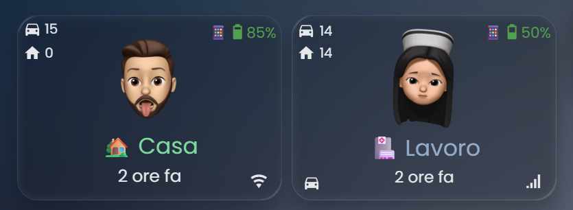

# 👤 Person Tracker Card for Home Assistant

[](https://github.com/custom-components/hacs)
[](https://github.com/djdevil/person-tracker-card)


Advanced card for Home Assistant that displays detailed information about people with complete visual editor and three layout modes.

## 📑 Classic Layout


## 📑 Compact Layout


## 📑 Modern Layout 🆕


**[🇬🇧 English](#english-version) | [🇮🇹 Versione Italiana](#versione-italiana)**

---


[](https://my.home-assistant.io/redirect/hacs_repository/?owner=djdevil&repository=person-tracker-card&category=plugin)

<a name="english-version"></a>
## 📑 Table of Contents

- [✨ Key Features](#-key-features)
- [🎨 Layout Modes](#-layout-modes)
- [📦 Installation](#-installation)
- [🔧 Configuration](#-configuration)
- [📱 Mobile App Integration](#-mobile-app-integration)
- [🎭 Examples](#-examples)
- [🔍 Troubleshooting](#-troubleshooting)

---

## ✨ Key Features

- 🎨 **Three Layout Modes**
  - **Classic**: Fully customizable with positionable elements
  - **Compact**: Space-efficient horizontal grid layout
  - **Modern**: Sleek design with circular progress indicators 🆕
- 📱 **Battery Monitoring** - Phone battery with dynamic icon and color
- ⌚ **Watch Battery** - Apple Watch and smartwatch support
- 🚶 **Activity Tracking** - Walking, Running, Automotive, Stationary, Cycling
- 📍 **Distance from Home** - Waze integration
- ⏱️ **Travel Time** - Estimated time to reach home/work
- 📶 **Connection Type** - WiFi or mobile network indicator
- 🎨 **Customizable States** - Different colors and images for each location
- 🖼️ **Custom Images** - PNG/GIF with transparency support
- 🎯 **Complete Visual Editor** - User-friendly GUI configuration
- 🎨 **Highly Customizable** - Fonts, colors, sizes, background

---

## 🎨 Layout Modes

### Classic Layout
Full-size card with customizable element positioning.

**Perfect for:**
- Large dashboard cards
- Maximum customization
- Custom aspect ratios
- Freely positionable elements

```yaml
type: custom:person-tracker-card
entity: person.davide
layout: classic
aspect_ratio: '1/0.7'
picture_size: 60
battery_position: top-right
activity_position: bottom-left
```

### Compact Layout
Horizontal grid layout with fixed structure.

**Perfect for:**
- Multiple people tracking
- Space-limited dashboards
- Mobile interfaces
- Dense information display

```yaml
type: custom:person-tracker-card
entity: person.davide
layout: compact
compact_width: 300  # 200-500px
```

**Layout structure:**
```
┌────────────────────────────┐
│ 🖼️  Person Name           │
│ 40px  📍 Location         │
├────────────────────────────┤
│ 🚶 📶 📱 ⌚ 🏠         │
└────────────────────────────┘
```

### Modern Layout 🆕
Sleek horizontal design with circular progress indicators.

**Perfect for:**
- Modern, minimal dashboards
- Visual battery/distance representation
- Clean and elegant interfaces
- Auto-expanding responsive cards

```yaml
type: custom:person-tracker-card
entity: person.davide
layout: modern
modern_picture_size: 45
modern_name_font_size: '16px'
modern_state_font_size: '13px'
```

**Layout structure:**
```
┌──────────────────────────────────────────────┐
│  ┌───┐                                       │
│  │🖼️│  PERSON NAME    ⭕ ⭕ 🚶 📶 ⭕ ⭕  │
│  └───┘  📍 Location    📱 ⌚ 🏃 📡 🏠 🚗  │
└──────────────────────────────────────────────┘
     ▲         ▲                    ▲
   Photo    Name/State      Circular Indicators
  (colored                  (Battery, Watch,
   border)                   Distance, Travel)
```

**Modern Layout Features:**
- 🔵 **Circular Progress Rings** - Visual representation of battery %, distance, travel time
- 🟢 **State-Colored Border** - Picture border changes based on state (green=home, red=away, orange=other)
- 🎯 **Icon Badges** - Activity and connection shown as icon circles
- 📐 **Auto-Expanding** - Card width adapts to number of visible indicators
- 🎨 **Customizable Fonts** - Separate font sizes for name and state

---

## 📦 Installation

### Installation via HACS (Recommended)

Have [HACS](https://hacs.xyz/) installed, this will allow you to update easily.

* Adding Person Tracker Card to HACS can be done using this button:

[](https://my.home-assistant.io/redirect/hacs_repository/?owner=djdevil&repository=person-tracker-card&category=plugin)

> [!NOTE]
> If the button above doesn't work, add `https://github.com/djdevil/person-tracker-card` as a custom repository of type **Dashboard** in HACS.

* Click Install on the `Person Tracker Card` card.
* Restart Home Assistant.

### Manual Installation

1. Download `person-tracker-card.js` and `person-tracker-card-editor.js`
2. Copy to `config/www/person-tracker-card/`
3. Add resource:
   - Settings → Dashboards → ⋮ → Resources
   - **+ ADD RESOURCE**
   - URL: `/local/person-tracker-card/person-tracker-card.js`
   - Type: **JavaScript Module**
4. Hard refresh browser (Ctrl+Shift+R)

---

## 🔧 Configuration

### Quick Start (GUI Editor)

1. Edit dashboard → Add card
2. Search **Person Tracker Card**
3. Select **person** entity
4. Choose **layout** (classic/compact/modern)
5. Configure sensors and style

### Basic YAML

```yaml
type: custom:person-tracker-card
entity: person.davide
layout: modern  # or 'classic' or 'compact'
```

### Modern Layout Configuration 🆕

```yaml
type: custom:person-tracker-card
entity: person.davide
layout: modern

# Display options
show_entity_picture: true
show_person_name: true
show_name: true
show_battery: true
show_watch_battery: true
show_activity: true
show_connection: true
show_distance: true
show_travel_time: true

# Modern layout specific
modern_picture_size: 45           # Picture size in px (30-80)
modern_name_font_size: '16px'     # Name font size
modern_state_font_size: '13px'    # State/location font size
modern_travel_max_time: 60        # Max travel time for ring calculation

# Custom sensors (optional)
battery_sensor: sensor.phone_davide_battery_level
watch_battery_sensor: sensor.watch_davide_battery_level
activity_sensor: sensor.phone_davide_activity
connection_sensor: sensor.phone_davide_connection_type
distance_sensor: sensor.waze_davide
travel_sensor: sensor.waze_davide

# Styling
card_background: 'rgba(255,255,255,0.05)'
card_border_radius: '15px'

# Custom states with colors (border color follows state)
state:
  - value: home
    name: 🏡 Home
    styles:
      name:
        color: '#50A14F'
  - value: not_home
    name: 🚗 Away
    styles:
      name:
        color: '#e45649'
  - value: work
    name: 🏢 Office
    styles:
      name:
        color: '#ffa229'
```

### Compact Layout Configuration

```yaml
type: custom:person-tracker-card
entity: person.davide
layout: compact
compact_width: 300        # Width in pixels (200-500)
show_entity_picture: true
show_name: true
show_battery: true
show_watch_battery: true
show_activity: true
show_connection: true
show_distance: true
show_travel_time: true

# Custom sensors (optional)
battery_sensor: sensor.phone_davide_battery_level
watch_battery_sensor: sensor.watch_davide_battery_level
activity_sensor: sensor.phone_davide_activity
connection_sensor: sensor.phone_davide_connection_type
distance_sensor: sensor.waze_davide

# Styling
card_background: 'rgba(255,255,255,0.05)'
card_border_radius: '12px'
```

### Classic Layout Configuration

```yaml
type: custom:person-tracker-card
entity: person.davide
layout: classic
aspect_ratio: '1/0.7'
picture_size: 55
show_entity_picture: true
show_name: true
show_last_changed: true
show_battery: true
show_watch_battery: true
show_activity: true
show_connection: true
show_distance: true
show_travel_time: true

# Element positioning
battery_position: top-right
watch_battery_position: top-right-2
activity_position: bottom-left
distance_position: top-left
travel_position: top-left-2
connection_position: bottom-right

# Font sizes
name_font_size: '20px'
state_font_size: '14px'
battery_font_size: '13px'
activity_font_size: '13px'

# Styling
card_background: 'rgba(255,255,255,0.05)'
card_border_radius: '15px'
```

### Available Positions (Classic only)

- `top-left`, `top-right`
- `bottom-left`, `bottom-right`
- `top-left-2`, `top-right-2`
- `bottom-left-2`, `bottom-right-2`

### Custom States with Colors

```yaml
state:
  - value: home
    name: 🏡 Home
    styles:
      name:
        color: '#7DDA9F'
  
  - value: not_home
    name: 🏃‍♂️ Away
    styles:
      name:
        color: '#93ADCB'
  
  - value: work
    name: 🏢 Office
    entity_picture: /local/images/office.png
    styles:
      name:
        color: '#FFD700'
```

---

## 📱 Mobile App Integration

### Required Permissions

**iOS - Home Assistant Companion App:**
1. Location: Settings → App → Location → **Always**
2. Motion & Fitness: Settings → Privacy → Motion & Fitness → **ON**

**Android - Home Assistant Companion App:**
1. Location: Always allow
2. Physical Activity: Enable in app settings

### Automatic Sensor Detection

The card automatically finds these sensors:

```
sensor.phone_[name]_battery_level
sensor.phone_[name]_activity
sensor.phone_[name]_connection_type
sensor.watch_[name]_battery_level
```

Where `[name]` is your person entity name without `person.` prefix.

Example for `person.davide`:
```
sensor.phone_davide_battery_level
sensor.phone_davide_activity
sensor.phone_davide_connection_type
sensor.watch_davide_battery_level
```

### Waze Integration

For distance tracking:

1. Settings → Devices & Services → Add Integration
2. Search **Waze Travel Time**
3. Configure:
   - Origin: `zone.home`
   - Destination: `person.name`
   - Name: `waze_name`

---

## 🎭 Examples

### Modern Layout - Family Dashboard 🆕

```yaml
type: vertical-stack
cards:
  - type: custom:person-tracker-card
    entity: person.davide
    layout: modern
    modern_picture_size: 50
    modern_name_font_size: '16px'
    state:
      - value: home
        name: 🏡 Casa
        styles:
          name:
            color: '#50A14F'
      - value: not_home
        name: 🚗 Fuori
        styles:
          name:
            color: '#e45649'
    
  - type: custom:person-tracker-card
    entity: person.nunzia
    layout: modern
    modern_picture_size: 50
    modern_name_font_size: '16px'
    state:
      - value: home
        name: 🏡 Casa
        styles:
          name:
            color: '#50A14F'
      - value: not_home
        name: 🚗 Fuori
        styles:
          name:
            color: '#e45649'
```

### Compact Grid - Multiple People

```yaml
type: grid
columns: 2
cards:
  - type: custom:person-tracker-card
    entity: person.davide
    layout: compact
    compact_width: 280
    
  - type: custom:person-tracker-card
    entity: person.nunzia
    layout: compact
    compact_width: 280
    
  - type: custom:person-tracker-card
    entity: person.child
    layout: compact
    compact_width: 280
    
  - type: custom:person-tracker-card
    entity: person.grandpa
    layout: compact
    compact_width: 280
```

### Vertical Stack - Mobile View

```yaml
type: vertical-stack
cards:
  - type: custom:person-tracker-card
    entity: person.davide
    layout: modern
    
  - type: custom:person-tracker-card
    entity: person.nunzia
    layout: modern
```

### Mixed Layout

```yaml
type: vertical-stack
cards:
  - type: custom:person-tracker-card
    entity: person.davide
    layout: classic
    aspect_ratio: '1/1'
    
  - type: horizontal-stack
    cards:
      - type: custom:person-tracker-card
        entity: person.child1
        layout: modern
        
      - type: custom:person-tracker-card
        entity: person.child2
        layout: modern
```

### Minimal Modern (Sidebar)

```yaml
type: custom:person-tracker-card
entity: person.davide
layout: modern
show_watch_battery: false
show_travel_time: false
show_distance: false
show_activity: false
show_connection: false
```

---

## 🔍 Troubleshooting

### Card doesn't appear
- Check browser console (F12) for errors
- Verify resource is loaded in Dashboard → Resources
- Hard refresh: Ctrl+Shift+R

### Sensors not found
- Check Companion App is installed
- Verify sensor names in Developer Tools → States
- Manually specify sensors in configuration

### Images don't show
- Place files in `config/www/`
- Use correct path: `/local/folder/file.png`
- Restart Home Assistant if needed

### Editor doesn't open
- Ensure both JS files are loaded
- Clear browser cache
- Restart Home Assistant

### Layout doesn't change
- Verify `layout: 'modern'` or `layout: 'compact'` or `layout: 'classic'`
- Values are case-sensitive
- Clear cache and reload

### Modern layout rings overlap text
- Update to latest version (v1.2.0+)
- Card now auto-expands based on indicators

---

## 📝 Changelog

### v1.2.0 (2025-05-30) 🆕
- ✨ **New Modern Layout** with circular progress indicators
- 🔵 Circular SVG rings for battery, watch, distance, travel time
- 🟢 State-colored picture border (green/red/orange)
- 🎯 Icon badges for activity and connection
- ⚙️ Customizable font sizes for Modern layout
- 📐 Auto-expanding responsive design
- 🎨 Improved activity icon mapping with entity attribute support

### v1.1.2 (2025-01-25)
- 📏 Dynamic distance unit from entity attributes
- 🎯 Dynamic activity icon from entity attributes
- 🔤 State and last changed font customization
- 🤖 Fixed Android WiFi detection

### v1.1.1 (2024-11-24)
- 🌍 Complete multilanguage support (EN, IT, FR, DE)
- 🔄 Automatic language detection from Home Assistant

### v1.1.0 (2024-11-23)
- ✨ New compact layout mode
- 📏 Configurable width for compact layout (200-500px)
- ⌚ Watch battery support

### v1.0.0 (2024-11-22)
- 🎉 Initial public release
- ✨ Complete visual editor
- 📱 Full Companion App support
- 🎨 Customizable states
- 📍 Waze integration

---

## 🤝 Contributing

Contributions welcome! Please:

1. Fork the repository
2. Create feature branch (`git checkout -b feature/AmazingFeature`)
3. Commit changes (`git commit -m 'Add AmazingFeature'`)
4. Push to branch (`git push origin feature/AmazingFeature`)
5. Open Pull Request

---

## 📄 License

MIT License - See [LICENSE](LICENSE) file

---

## 💝 Support

If you find this card useful:

- ⭐ Star the repository
- 🐛 Report bugs
- 💡 Suggest features
- 🤝 Contribute code

---

## 🙏 Credits

- Home Assistant Community
- HACS Team
- All contributors

---

**Made with ❤️ for the Home Assistant Community**

---

<a name="versione-italiana"></a>
# 👤 Person Tracker Card per Home Assistant

**[🇬🇧 English](#english-version) | [🇮🇹 Versione Italiana](#versione-italiana)**

---

## ✨ Caratteristiche Principali

- 🎨 **Tre Modalità di Layout**
  - **Classic**: Completamente personalizzabile con elementi posizionabili
  - **Compact**: Layout a griglia orizzontale per risparmiare spazio
  - **Modern**: Design elegante con indicatori circolari di progresso 🆕
- 📱 **Monitoraggio Batteria** - Batteria telefono con icona e colore dinamici
- ⌚ **Batteria Smartwatch** - Supporto Apple Watch e altri smartwatch
- 🚶 **Tracciamento Attività** - Walking, Running, Automotive, Stationary, Cycling
- 📍 **Distanza da Casa** - Integrazione Waze
- ⏱️ **Tempo di Viaggio** - Tempo stimato per raggiungere casa/lavoro
- 📶 **Tipo Connessione** - Indicatore WiFi o rete mobile
- 🎨 **Stati Personalizzabili** - Colori e immagini diverse per ogni posizione
- 🖼️ **Immagini Personalizzate** - Supporto PNG/GIF con trasparenza
- 🎯 **Editor Visuale Completo** - Configurazione tramite GUI
- 🎨 **Altamente Personalizzabile** - Font, colori, dimensioni, background

---

## 🎨 Modalità Layout

### Layout Classic
Card a dimensione intera con posizionamento elementi personalizzabile.

**Perfetto per:**
- Card dashboard grandi
- Massima personalizzazione
- Aspect ratio personalizzati
- Elementi posizionabili liberamente

```yaml
type: custom:person-tracker-card
entity: person.davide
layout: classic
aspect_ratio: '1/0.7'
picture_size: 60
battery_position: top-right
activity_position: bottom-left
```

### Layout Compact
Layout a griglia orizzontale con struttura fissa.

**Perfetto per:**
- Tracciamento di più persone
- Dashboard con spazio limitato
- Interfacce mobile
- Visualizzazione densa di informazioni

```yaml
type: custom:person-tracker-card
entity: person.davide
layout: compact
compact_width: 300  # 200-500px
```

**Struttura layout:**
```
┌────────────────────────────┐
│ 🖼️  Nome Persona          │
│ 40px  📍 Posizione        │
├────────────────────────────┤
│ 🚶 📶 📱 ⌚ 🏠         │
└────────────────────────────┘
```

### Layout Modern 🆕
Design orizzontale elegante con indicatori circolari di progresso.

**Perfetto per:**
- Dashboard moderne e minimali
- Rappresentazione visiva batteria/distanza
- Interfacce pulite ed eleganti
- Card responsive che si espandono automaticamente

```yaml
type: custom:person-tracker-card
entity: person.davide
layout: modern
modern_picture_size: 45
modern_name_font_size: '16px'
modern_state_font_size: '13px'
```

**Struttura layout:**
```
┌──────────────────────────────────────────────┐
│  ┌───┐                                       │
│  │🖼️│  NOME PERSONA   ⭕ ⭕ 🚶 📶 ⭕ ⭕  │
│  └───┘  📍 Posizione   📱 ⌚ 🏃 📡 🏠 🚗  │
└──────────────────────────────────────────────┘
     ▲         ▲                    ▲
   Foto    Nome/Stato       Indicatori Circolari
  (bordo                    (Batteria, Watch,
  colorato)                  Distanza, Viaggio)
```

**Funzionalità Layout Modern:**
- 🔵 **Anelli di Progresso Circolari** - Rappresentazione visiva di batteria %, distanza, tempo viaggio
- 🟢 **Bordo Colorato per Stato** - Il bordo foto cambia in base allo stato (verde=casa, rosso=fuori, arancione=altro)
- 🎯 **Badge Icone** - Attività e connessione mostrate come cerchi con icone
- 📐 **Auto-Espandibile** - La larghezza card si adatta al numero di indicatori visibili
- 🎨 **Font Personalizzabili** - Dimensioni font separate per nome e stato

---

## 📦 Installazione

### Installazione via HACS (Consigliato)

Assicurati di avere [HACS](https://hacs.xyz/) installato, questo ti permetterà di aggiornare facilmente.

* Puoi aggiungere Person Tracker Card a HACS usando questo pulsante:

[](https://my.home-assistant.io/redirect/hacs_repository/?owner=djdevil&repository=person-tracker-card&category=plugin)

> [!NOTE]
> Se il pulsante sopra non funziona, aggiungi `https://github.com/djdevil/person-tracker-card` come repository personalizzata di tipo **Dashboard** in HACS.

* Clicca Installa sulla card `Person Tracker Card`.
* Riavvia Home Assistant.

### Installazione Manuale

1. Scarica `person-tracker-card.js` e `person-tracker-card-editor.js`
2. Copia in `config/www/person-tracker-card/`
3. Aggiungi risorsa:
   - Impostazioni → Dashboard → ⋮ → Risorse
   - **+ AGGIUNGI RISORSA**
   - URL: `/local/person-tracker-card/person-tracker-card.js`
   - Tipo: **Modulo JavaScript**
4. Ricarica forzata browser (Ctrl+Shift+R)

---

## 🔧 Configurazione

### Quick Start (Editor GUI)

1. Modifica dashboard → Aggiungi card
2. Cerca **Person Tracker Card**
3. Seleziona entità **person**
4. Scegli **layout** (classic/compact/modern)
5. Configura sensori e stile

### YAML Base

```yaml
type: custom:person-tracker-card
entity: person.davide
layout: modern  # oppure 'classic' o 'compact'
```

### Configurazione Layout Modern 🆕

```yaml
type: custom:person-tracker-card
entity: person.davide
layout: modern

# Opzioni visualizzazione
show_entity_picture: true
show_person_name: true
show_name: true
show_battery: true
show_watch_battery: true
show_activity: true
show_connection: true
show_distance: true
show_travel_time: true

# Specifiche layout modern
modern_picture_size: 45           # Dimensione foto in px (30-80)
modern_name_font_size: '16px'     # Dimensione font nome
modern_state_font_size: '13px'    # Dimensione font stato/posizione
modern_travel_max_time: 60        # Tempo max viaggio per calcolo anello

# Sensori personalizzati (opzionale)
battery_sensor: sensor.phone_davide_battery_level
watch_battery_sensor: sensor.watch_davide_battery_level
activity_sensor: sensor.phone_davide_activity
connection_sensor: sensor.phone_davide_connection_type
distance_sensor: sensor.waze_davide
travel_sensor: sensor.waze_davide

# Stile
card_background: 'rgba(255,255,255,0.05)'
card_border_radius: '15px'

# Stati personalizzati con colori (il colore bordo segue lo stato)
state:
  - value: home
    name: 🏡 Casa
    styles:
      name:
        color: '#50A14F'
  - value: not_home
    name: 🚗 Fuori
    styles:
      name:
        color: '#e45649'
  - value: work
    name: 🏢 Ufficio
    styles:
      name:
        color: '#ffa229'
```

### Configurazione Layout Compact

```yaml
type: custom:person-tracker-card
entity: person.davide
layout: compact
compact_width: 300        # Larghezza in pixel (200-500)
show_entity_picture: true
show_name: true
show_battery: true
show_watch_battery: true
show_activity: true
show_connection: true
show_distance: true
show_travel_time: true

# Sensori personalizzati (opzionale)
battery_sensor: sensor.iphonedavide_battery_level
watch_battery_sensor: sensor.watch_davide_battery_level
activity_sensor: sensor.iphonedavide_activity
connection_sensor: sensor.iphonedavide_connection_type
distance_sensor: sensor.waze_davide

# Stile
card_background: 'rgba(255,255,255,0.05)'
card_border_radius: '12px'
```

### Configurazione Layout Classic

```yaml
type: custom:person-tracker-card
entity: person.davide
layout: classic
aspect_ratio: '1/0.7'
picture_size: 55
show_entity_picture: true
show_name: true
show_last_changed: true
show_battery: true
show_watch_battery: true
show_activity: true
show_connection: true
show_distance: true
show_travel_time: true

# Posizionamento elementi
battery_position: top-right
watch_battery_position: top-right-2
activity_position: bottom-left
distance_position: top-left
travel_position: top-left-2
connection_position: bottom-right

# Dimensioni font
name_font_size: '20px'
state_font_size: '14px'
battery_font_size: '13px'
activity_font_size: '13px'

# Stile
card_background: 'rgba(255,255,255,0.05)'
card_border_radius: '15px'
```

### Posizioni Disponibili (Solo Classic)

- `top-left`, `top-right`
- `bottom-left`, `bottom-right`
- `top-left-2`, `top-right-2`
- `bottom-left-2`, `bottom-right-2`

### Stati Personalizzati con Colori

```yaml
state:
  - value: home
    name: 🏡 Casa
    styles:
      name:
        color: '#7DDA9F'
  
  - value: not_home
    name: 🏃‍♂️ Fuori
    styles:
      name:
        color: '#93ADCB'
  
  - value: Lavoro Davide
    name: 🏢 Ufficio
    entity_picture: /local/foto-pkg/davidelavoro.gif
    styles:
      name:
        color: '#FFD700'
```

---

## 📱 Integrazione App Mobile

### Permessi Richiesti

**iOS - App Home Assistant Companion:**
1. Posizione: Impostazioni → App → Posizione → **Sempre**
2. Movimento e Fitness: Impostazioni → Privacy → Movimento e Fitness → **ON**

**Android - App Home Assistant Companion:**
1. Posizione: Consenti sempre
2. Attività Fisica: Abilita nelle impostazioni app

### Rilevamento Automatico Sensori

La card trova automaticamente questi sensori:

```
sensor.phone_[nome]_battery_level
sensor.phone_[nome]_activity
sensor.phone_[nome]_connection_type
sensor.watch_[nome]_battery_level
```

Dove `[nome]` è il nome della tua entità person senza `person.`

Esempio per `person.davide`:
```
sensor.phone_davide_battery_level
sensor.phone_davide_activity
sensor.phone_davide_connection_type
sensor.watch_davide_battery_level
```

### Integrazione Waze

Per il tracciamento distanza:

1. Impostazioni → Dispositivi e Servizi → Aggiungi Integrazione
2. Cerca **Waze Travel Time**
3. Configura:
   - Origine: `zone.home`
   - Destinazione: `person.nome`
   - Nome: `waze_nome`

---

## 🎭 Esempi

### Layout Modern - Dashboard Famiglia 🆕

```yaml
type: vertical-stack
cards:
  - type: custom:person-tracker-card
    entity: person.davide
    layout: modern
    modern_picture_size: 50
    modern_name_font_size: '16px'
    state:
      - value: home
        name: 🏡 Casa
        styles:
          name:
            color: '#50A14F'
      - value: not_home
        name: 🚗 Fuori
        styles:
          name:
            color: '#e45649'
    
  - type: custom:person-tracker-card
    entity: person.nunzia
    layout: modern
    modern_picture_size: 50
    modern_name_font_size: '16px'
    state:
      - value: home
        name: 🏡 Casa
        styles:
          name:
            color: '#50A14F'
      - value: not_home
        name: 🚗 Fuori
        styles:
          name:
            color: '#e45649'
```

### Griglia Compact - Più Persone

```yaml
type: grid
columns: 2
cards:
  - type: custom:person-tracker-card
    entity: person.davide
    layout: compact
    compact_width: 280
    
  - type: custom:person-tracker-card
    entity: person.nunzia
    layout: compact
    compact_width: 280
    
  - type: custom:person-tracker-card
    entity: person.bambino
    layout: compact
    compact_width: 280
    
  - type: custom:person-tracker-card
    entity: person.nonno
    layout: compact
    compact_width: 280
```

### Stack Verticale - Vista Mobile

```yaml
type: vertical-stack
cards:
  - type: custom:person-tracker-card
    entity: person.davide
    layout: modern
    
  - type: custom:person-tracker-card
    entity: person.nunzia
    layout: modern
```

### Layout Misto

```yaml
type: vertical-stack
cards:
  - type: custom:person-tracker-card
    entity: person.davide
    layout: classic
    aspect_ratio: '1/1'
    
  - type: horizontal-stack
    cards:
      - type: custom:person-tracker-card
        entity: person.figlio1
        layout: modern
        
      - type: custom:person-tracker-card
        entity: person.figlio2
        layout: modern
```

### Modern Minimale (Sidebar)

```yaml
type: custom:person-tracker-card
entity: person.davide
layout: modern
show_watch_battery: false
show_travel_time: false
show_distance: false
show_activity: false
show_connection: false
```

---

## 🔍 Risoluzione Problemi

### La card non appare
- Controlla console browser (F12) per errori
- Verifica risorsa caricata in Dashboard → Risorse
- Ricarica forzata: Ctrl+Shift+R

### Sensori non trovati
- Controlla Companion App installata
- Verifica nomi sensori in Strumenti Sviluppatore → Stati
- Specifica manualmente i sensori nella configurazione

### Immagini non appaiono
- Inserisci file in `config/www/`
- Usa percorso corretto: `/local/cartella/file.png`
- Riavvia Home Assistant se necessario

### Editor non si apre
- Assicurati che entrambi i file JS siano caricati
- Svuota cache browser
- Riavvia Home Assistant

### Layout non cambia
- Verifica `layout: 'modern'` o `layout: 'compact'` o `layout: 'classic'`
- I valori sono case-sensitive
- Svuota cache e ricarica

### I cerchi del layout Modern si sovrappongono al testo
- Aggiorna all'ultima versione (v1.2.0+)
- La card ora si espande automaticamente in base agli indicatori

---

## 📝 Changelog

### v1.2.0 (2025-05-30) 🆕
- ✨ **Nuovo Layout Modern** con indicatori circolari di progresso
- 🔵 Anelli SVG circolari per batteria, watch, distanza, tempo viaggio
- 🟢 Bordo foto colorato in base allo stato (verde/rosso/arancione)
- 🎯 Badge icone per attività e connessione
- ⚙️ Dimensioni font personalizzabili per layout Modern
- 📐 Design responsive auto-espandibile
- 🎨 Mapping icone attività migliorato con supporto attributi entità

### v1.1.2 (2025-01-25)
- 📏 Unità distanza dinamica dagli attributi entità
- 🎯 Icona attività dinamica dagli attributi entità
- 🔤 Personalizzazione font stato e last changed
- 🤖 Corretto rilevamento WiFi Android

### v1.1.1 (2024-11-24)
- 🌍 Supporto multilingua completo (EN, IT, FR, DE)
- 🔄 Rilevamento automatico lingua da Home Assistant

### v1.1.0 (2024-11-23)
- ✨ Nuova modalità layout compact
- 📏 Larghezza configurabile per layout compact (200-500px)
- ⌚ Supporto batteria smartwatch

### v1.0.0 (2024-11-22)
- 🎉 Prima release pubblica
- ✨ Editor visuale completo
- 📱 Supporto completo Companion App
- 🎨 Stati personalizzabili
- 📍 Integrazione Waze

---

## 🤝 Contribuire

Contributi benvenuti! Per favore:

1. Fai Fork del repository
2. Crea feature branch (`git checkout -b feature/FunzionalitàFica`)
3. Committa modifiche (`git commit -m 'Aggiungi FunzionalitàFica'`)
4. Push al branch (`git push origin feature/FunzionalitàFica`)
5. Apri Pull Request

---

## 📄 Licenza

Licenza MIT - Vedi file [LICENSE](LICENSE)

---

## 💝 Supporto

Se trovi utile questa card:

- ⭐ Stella il repository
- 🐛 Segnala bug
- 💡 Suggerisci funzionalità
- 🤝 Contribuisci al codice

---

## 🙏 Ringraziamenti

- Home Assistant Community
- HACS Team
- Tutti i contributori

---

**Realizzato con ❤️ per la Community Home Assistant**
